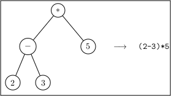
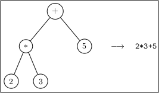
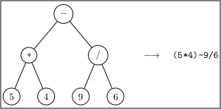
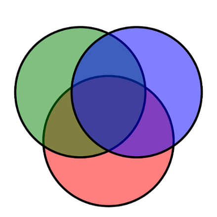

#  Bases de la programmation orientée objet 
### IUT Montpellier-Sète – Département Informatique
* **Cours:** [M2103](http://cache.media.enseignementsup-recherche.gouv.fr/file/25/09/7/PPN_INFORMATIQUE_256097.pdf) - support [ici](https://github.com/IUTInfoMontp-M2103/Ressources)
* **Enseignants:** [Marin Bougeret](mailto:marin.bougeret@umontpellier.fr), [Sébastien Gagné](mailto:sebastien.gagne@umontpellier.fr), [Victor Poupet](mailto:victor.poupet@umontpellier.fr), [Petru Valicov](mailto:petru.valicov@umontpellier.fr), [Bruno Yun](mailto:bruno.yun@umontpellier.fr) 
* Le [forum Piazza](https://piazza.com/class/jpv7gf0lltk4kc) de ce cours pour poser vos questions
* [Email](mailto:petru.valicov@umontpellier.fr) pour une question d'ordre privée concernant le cours.
* Le [sujet du TP](https://gitprint.com/IUTInfoMontp-M2103/TP8) en format .pdf téléchargeable et imprimable.

Avant de démarrer le TP, vérifiez que vous n'avez pas atteint votre quota d'espace de stockage autorisé :
* placez-vous dans votre `$HOME` et utilisez les commandes suivantes :
    * `du -sh` pour voir combien d'espace vous avez déjà utilisé
    * `du -sh *` pour voir combien d'espace vous avez déjà utilisé pour chaque fichier (sans fichiers cachés)
    * `du -sch .[!.]* *` pour voir combien d'espace vous avez déjà utilisé pour chaque fichier, y compris les fichiers cachés
* Supprimez les fichiers inutiles.
* Pour éviter des problèmes durant vos TPs d'informatique, vous devriez toujours **garder 300-400 Mo d'espace libre**.

## TP8
#### _Thème : Interfaces et héritage_

Cliquez sur le lien ci-dessous pour faire votre fork privé du TP (**attention, pas de fork à la main !**):

https://classroom.github.com/a/CFC6e_iJ

Date limite de rendu de votre code sur le dépôt GitHub : **Vendredi 29 mars à 23h00**

### Exercice 1 - Expressions Arithmétiques

Vous allez écrire une petite application qui gère les expressions arithmétiques composées des quatre opérations mathématiques usuelles (-, +, / et *). Pour simplifier on supposera que les opérations de nos expressions arithmétiques sont d'arité 2, c'est-à-dire ont deux opérandes. Par exemple :

 * `(2+3)*4-1`  &rightarrow; expression valide
 * `5*4-9/6`  &rightarrow; expression valide
 * `+(2+3)*4-1`  &rightarrow; expression non valide
 * `-1` &rightarrow; expression non valide

En respectant les priorités des opérateurs et des parenthèses, on peut représenter une expression arithmétiques sous
forme d'une structure arborescente, comme indiqué ci-dessous (on appelle ces structures _arbres binaires_) :





On souhaite programmer une petite application qui, à partir d'une expression arithmétique donnée sous forme d'arbre binaire,
calcule la valeur du résultat de cette expression. Par exemple pour chacun des trois arbres donnés ci-dessus, le
résultat devrait être -5, 11 et 18.5 respectivement.

Les premiers bouts de code vous sont donnés dans le package `fr.umontpellier.iut.expressions`. L'interface `Expression`
modélise les expressions arithmétiques. Observez la méthode `double calculerValeur()`. Cette méthode doit retourner le
résultat du calcul de l'expression arithmétique.

1. Écrivez deux classes `SousExpression` et `Nombre` implémentant chacune l'interface `Expression` et faites
en sorte que votre programme compile.

2. Intuitivement, la classe `Nombre` va correspondre à la feuille de votre arbre binaire, alors que la classe
`SousExpression` va correspondre à un noeud interne de l'arbre. Une `SousExpression` sera donc composée d'un caractère représentant l'opérateur, et de ses deux sous-expressions. Ajoutez le code nécessaire à ces deux classes pour
 modéliser cette information et pour que `double calculerValeur()` retourne le résultat d'évaluation de l'expression
 correspondante a sa classe. Ainsi, dans la classe cliente (`AppExpression`),
 on devrait pouvoir construire un expression arithmétique et ensuite calculer son résultat :
 
    ```java
    Expression monExpr; 
    //pour consrtuire une Expression, il faudra d'abord créer les Nombres, puis les Expressions utilisant ces nombres, etc.
    double resultat = monExpr.calculerValeur(); // évalue l'expression
    System.out.println(resultat);
    ```
  
3. On souhaite maintenant pouvoir afficher une expression arithmétique en format texte (lisible par l'humain) à partir
de l'arbre binaire. Par exemple le texte de l'abre le plus à gauche devrait être ((2-3)*5). En vous inspirant de la
solution à la question précédente, rédefinissez la méthode `toString()` dans `SousExpression` et `Nombre` afin de
de permettre l'affichage d'une expression arithmétique. À l'utilisation cela devrait rassembler à quelque chose comme ceci :

    ```java
    Expression monExpr; // = new... à vous d'écrire le code nécessaire
    System.out.println(monExpr); // affiche bien le texte de l'expression
    ```
    **Attention** : pensez à respecter les priorités des opérateurs et donc mettre les parenthèses aux bons endroits...
    
4. Dessinez le diagramme de classes et discutez-en avec votre enseignant. Cette structure est une illustration concrète
d'un modèle [Composite](https://en.wikipedia.org/wiki/Composite_pattern). Le même modèle vous sera utile pour l'exercice
suivant, que l'on espère bien plus amusant !

  ### Exercice 2 - Images SVG

On se propose ici d'écrire une application qui permet à un utilisateur de produire des images SVG (extension `.svg`).
SVG est une abbréviation pour [Scalable Vector Graphics](https://fr.wikipedia.org/wiki/Scalable_Vector_Graphics), un
format XML permettant de décrire de manière textuelle une image. L'image est vue comme un _assemblage de plusieurs
composants graphiques_ (cercles, rectangles, lignes, etc.), regroupés suivant différents critères.

La philosophie ici est la même que pour une page HTML : la structure est décrite dans un format textuel à l'aide de
balises (_tag_ en anglais) est c'est l'interpreteur (_renderer_ en anglais) qui interprète le code pour "dessiner" le rendu.

Un squelette de code vous est donné dans le package `fr.umontpellier.iut.svg`. Dans cet exercice les noms des différents
éléments du code correspondent aux mots-clés de la norme SVG. Par conséquent, ces noms ne respecteront pas forcément les
conventions de nommage du _Java_. Également, c'est pour cela que l'ensemble de classes, attributs et méthodes sont nommés
en anglais. Voici le résumé de ces classes :

* `Tag` - modélise les balises
* `Style` - regroupe les différents styles graphiques que l'on peut appliquer à une balise (épaisseur du trait, couleur,
etc.). Donc, tous les objets de type `Tag` ont un attribut de type `Style`.
* `SVG` - représente la balise `<svg>...</svg>` qui se trouve à la _racine_ du fichier SVG (l'équivalent de la balise `<html>...</html>` en HTML). 
 
 1. En SVG les cercles sont représentés par des balises comme dans l'exemple suivant :
  
    ```xml
    <circle cx="5" cy="3" r="1.3"/>
    ```
    où `cx`, `cy` et `r` représentent respectivement les coordonnées du centre et le rayon.
    Écrivez une classe `Circle` héritant de `Tag` et qui a comme attributs `cx`, `cy` et `r` (de type `double`).
    Redéfinissez les méthodes nécessaires afin que la méthode `toSVG()` renvoie la balise correspondant à
    l'objet `Circle`.
  
    **Attention** : la méthode `toSVG()` est définie dans la classe `Tag` et vous **ne devez pas** la redéfinir.
 
 2. Générez une image SVG contenant un ou plusieurs cercles. Pour cela, instanciez un objet de type `SVG` dans la
 classe cliente `AppSVG`. Ajoutez lui un cercle en utilisant sa méthode `public void add(Tag tag)`. Vous pouvez
 ensuite générer le fichier SVG avec la méthode `public void saveAsFile(String filename)` de `SVG`.
 
 3. De manière similaire définissez la classe `Rectangle`. Voici un exemple de balise rectangle :
  
    ```xml
    <rect x="8" y="6" width="34" height="49"/>
    ```
    
    Testez dans le programme principal en générant une image SVG correspondante.
    
 4. Modifiez le code de la classe `Style` pour que l'on puisse ensuite dans le programme principal créer une image contenant deux figures ayant chacune un style différent. Pour les attributs `fill` et `stroke` de la classe `Style`, vous pouvez donner des noms de couleur tels `"green"` ou `"black"`. 
 
 5. En SVG la balise `<g>...</g>` permet de définir un _groupe_. Les groupes peuvent contenir d'autres balises (qui
 peuvent être des formes comme cercle, rectangle, etc. mais aussi des groupes). Ceci permet entre autres d'appliquer le
 style du groupe à tous ses éléments. Définissez la classe `Group` pour modéliser cette spécification.
 
 6. Le problème maintenant est que d'après la spécification SVG, les balises groupe (`<g>`) et `<svg>`, ne peuvent pas
 contenir de balise `<svg>`. Proposez une restructuration du code, afin de préserver le comportement programmé
 précédemment, mais aussi tenir compte de ces nouvelles contraintes. Dessinez le diagramme de classes.
 
 7. Si ce n'est pas déjà fait, remarquez que les classes `Group` et `SVG` partagent beaucoup de comportements...
 Proposez une solution en évitant cette duplication de code.
 
 8. Il est possible d'appliquer des _transformations_ géométriques (translation, rotation, etc.) aux différentes balises.
 Les transformations font partie du style (commun à toutes les balises) et s'appliquent l'une après l'autre. Exemple
 d'une balise rectangle à laquelle on applique successivement une mise à l'échelle, une rotation et une transformation :
 
    ```xml
    <rect x="0" y="0" width="100.9" height="63.5" transform="translate(30,40) rotate(-10 50 100) scale(1.05 0.5)"/>
    ```
 
    Remarquez qu'en SVG les transformations sont appliquées dans l'ordre inverse du texte contenu dans la balise.
    
    Implémentez les différentes classes de transformations afin que leur méthode `toString()` retourne le texte
    correspondant à la transformation. Dans un premier temps vous vous contenterez d'implémenter `Translate`, `Rotate`
    et `Scale`. Modifiez également la classe `Style` pour qu'elle gère une liste de transformations (attention à bien conserver l'ordre d'application).
 
 9. Implémentez la méthode `addTransform(...)` dans `Style` qui permet d'ajouter au style une transformation passée en paramètre.
  
 1. Ajoutez des attributs optionnels `rx` et `ry` à `Rectangle` qui permettent d'arrondir les angles du rectangle (voir la doc SVG).
    
    **Attention :** ces attributs sont optionnels, il faut donc laisser la possibilité à l'utilisateur de construire un rectangle sans ces nouveaux paramètres.
 
 1. À l'aide des classes que vous avez écrites, écrivez un programme qui génère un fichier SVG ayant le contenu suivant :
 
    ```xml
    <?xml version="1.0" standalone="no"?>
    <!DOCTYPE svg PUBLIC "-//W3C//DTD SVG 1.1//EN" "http://www.w3.org/Graphics/SVG/1.1/DTD/svg11.dtd">
    <svg xmlns="http://www.w3.org/2000/svg" width="1000.0" height="1000.0">
        <rect x="0.0" y="0.0" width="1000.0" height="1000.0" fill="lightblue"/>
        <g stroke="black" stroke-width="20.0" fill-opacity="0.8">
            <rect x="100.0" y="100.0" width="200.0" height="200.0" fill="#080" />
            <rect x="200.0" y="200.0" width="400.0" height="400.0" fill="#0C0" />
            <g transform="translate(0.0, 700.0) rotate(-45)">
                <rect x="100.0" y="100.0" width="200.0" height="200.0" fill="#800" />
                <rect x="200.0" y="200.0" width="400.0" height="400.0" fill="#C00" />
            </g>
        </g>
    </svg>
    ```
    (le code a été indenté pour plus de lisibilité mais vous n'avez pas à générer du code indenté)
 
 1. Écrivez un programme qui génère un fichier SVG représentant l'image ci-dessous :
    
    
  
    **Remarque :** Les trois cercles ont la même épaisseur de trait, couleur de bordure et transparence (50%).

 1. Dessinez le diagramme de classes final de votre application.
 
 1. **Bonus** : écrivez les autres classes de transformation `SkewX`, `SkewY` (des exemples ici : https://developer.mozilla.org/en-US/docs/Web/SVG/Attribute/transform)
